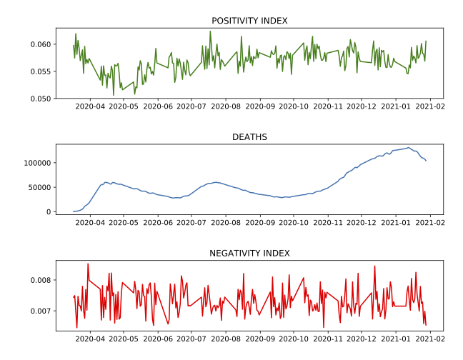

# Covid Happiness Analysis

## Project Summary
Analyze the correlation between happiness and covid deaths over time

## Final Chart

## Motivation/Methodology

I have observed that covid and the many effects that covid has on our daily lives from our favorite restaurants closing for good to not being able to leave our houses for weeks at a time has made people grumpy. This is, at its core, my hypothesis for this project.

My next step was to figure out: how was I going to measure grumpiness? My immediate thought was sentiment analysis. If I could find a dataset with words, I could analyze the sentiment in the words and track it by date, seeing if it correlated with covid upticks.

I decided to use the Yelp's extensive reviews data for my analysis. This dataset has a whopping 8,635,403 rows all in JSON format. To make this file usable, I converted the json module in python to convert each row into a dictionary and parsed out my target fields into a pipe delimeted file.

My next step was to add a sentiment analysis to these reviews. My first step here was to come up with measures for my sentiment analysis. I took a very simple approach, looking at frequency of positive words and frequency of negative words. I was able to web scrape lists of positive and negative words from https://www.cs.uic.edu/~liub/FBS/sentiment-analysis.html.

I created a sentimentAnalysis object which takes in two files of positive and negative words in its instantiator. The object has a method get_sentimentRates() which takes a String as an input. The method outputs the positive word rate and negative word rate of the input String. This method was used to add sentiment onto our reviews dataset.

Once I had the sentiment analysis, the next step was to connect it with covid data. To get this data I web scraped this website https://covidtracking.com/data/n which shows various national covid statistics. These statistics were added to our dataset which at this point in the process included the yelp data, sentiment analysis statistics, and covid data.

The next challenge was plotting the data to show a correlation. This proved harder than expected mostly because of the vast amount of data that I had. It was taking a very long time to try and aggregate this data by date in pure python. Therefore, I parallelized this data in Spark and was able to efficiently organize the data. In the end, after trying and looking at different metrics, I decided to take the average per day of the positive rate and negative rate. The rest of the covid stats did not need to be aggregated since they were on a per day basis in the first place.

The next stop was plotting, and at first I was discouraged. Looking ath the negative rate, it seemed pretty constant. But then I looked at the positive rate. Although the negative rate seems to be pretty constant over time, there is clearly a inverse relationship between the positive rate and covid deaths. In other words, the more covid deaths the less the positive rate. When there is a rise in deaths, there is a dip in the positive rate.

Although I could not see that people got more grumpy over covid, I could see that people got less happy. The difference between these two terms is very nuanced but it makes sense that as deaths rise people don't leave as many ecstatic and happy reviews on Yelp pages. 

